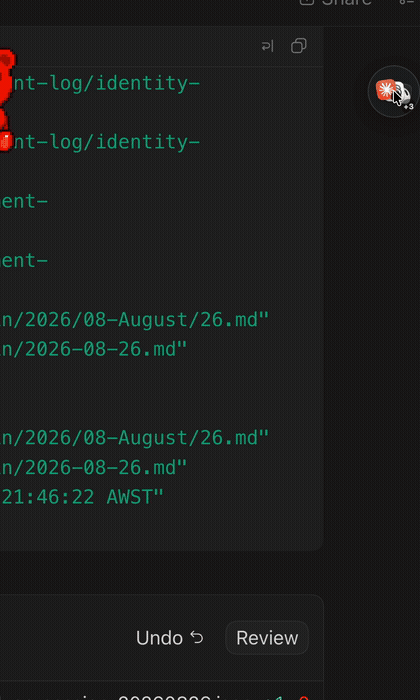

# 🟣 Hubby

**One tiny floating hub for every AI agent thread on your Mac.**

Hubby is a little orb that floats above everything — every app, every Space.
Tap it (or hit **⌃⌥H**) and it blooms into a calm blush-glass hub showing
every agent app on your machine, the threads running in each one, **which
agents are generating right now**, and — the part nothing else shows you —
**which agents are blocked waiting on you**.



Built for people who run ChatGPT/Codex, Claude Code, Cursor, Hermes, and
Grok Bot *at the same time* and keep losing track of which agent is doing
what, where.

## Install

**Homebrew:**

```sh
brew install lennoxsaint/tap/hubby
```

**Or the DMG:** grab `Hubby-x.y.z.dmg` from
[Releases](https://github.com/lennoxsaint/hubby/releases), drag Hubby to
Applications, launch. Signed + notarized — no Gatekeeper hoops.
Requires macOS 14+.

**Or build from source:**

```sh
git clone https://github.com/lennoxsaint/hubby && cd hubby
make run
```

## What it shows

Hubby's language is deliberately quiet — exactly two signals:

- **Shimmer** — that agent is generating *right now* (verified against the
  app's own session store, not guessed).
- **Amber** — that agent is blocked waiting on you. The one loud color.

Everything else is calm glass. Finished-but-unseen results surface through
row ordering and the hover recap card, not through badges.

- **Collapsed:** a draggable orb — your agent apps' icons fanned around a
  little octopus. Spin it like a fidget bearing (haptic ticks included),
  swipe to cycle which app leads, pinch out to bloom it open. Snaps to
  every Space, floats over fullscreen apps.
- **Expanded:** your **top-3 priorities** up top (see below), then one row
  per agent app, each unfurling into its live threads. Hover a thread for a
  recap card; when an agent is waiting on a question, an inline pill lets
  you **approve or pick an option without leaving the hub** (guarded — it
  re-verifies the exact pending prompt before a single keystroke is sent,
  and falls back to a plain jump if anything looks off).
- **Click a thread to jump**: Codex threads deep-link straight to the exact
  thread (`codex://threads/…`); Claude Code jumps land on the exact
  terminal window — even the exact Ghostty *tab* — when the Accessibility
  grant is on. A missing app shakes the hub instead of silently no-oping.
- **Priorities:** three slots, written in place. Click a number to tick it
  done — everything below promotes up, slot 3 frees for the next thing.
  Ticked items are appended with timestamps to a local ledger
  (`~/Library/Application Support/Hubby/priority-history.jsonl`) so your
  day leaves a record. That file never leaves your machine.
- **⌃⌥H** toggles the hub from anywhere. The menu-bar octopus has
  launch-at-login, per-adapter toggles, and update settings.

## Privacy

Hubby reads **local files only, read-only**, and sends **nothing**
anywhere: no telemetry, no analytics, no accounts. There is exactly one
optional exception — **"Check for Updates Automatically"** (menu bar,
**off by default**): when you enable it, Hubby makes a single anonymous
request to GitHub's public releases API at most once a day to see if a
newer version exists, and lights a menu item if so. It never
auto-downloads. Leave it off and Hubby never touches the network at all.

App icons are loaded at runtime from the apps installed on your Mac — no
logos ship in this repo.

## Accessibility permission (optional)

Without any permission, jumping to a Claude Code thread activates the right
terminal app. Grant Hubby **Accessibility** (it offers once, or via the
menu bar) and jumps become *exact*: the specific window — and in Ghostty,
the specific tab — that owns the session. The same grant powers the
in-hub answer pills. Skip it and everything else still works.

## Supported agent apps

| App | Threads | Liveness | How |
|---|---|---|---|
| Codex (ChatGPT desktop + CLI) | ✅ real | ✅ exact | `~/.codex` thread registry + rollout-tail turn detection |
| Claude Code | ✅ real | ✅ recency + prompts | `~/.claude/projects/**/*.jsonl` session files |
| Grok Bot | ✅ real | ✅ needs-you | roster blobs incl. `awaitingUserResponse` |
| Hermes | ✅ real | ✅ open-session | `~/.hermes/state.db` (`ended_at IS NULL`) |
| Cursor | ✅ real | 🟡 recency | `conversation-search.db` |
| Claude Desktop | 🟡 running-state | — | conversations are cloud-backed; no readable local store |

The ChatGPT desktop app *is* the Codex app (bundle `com.openai.codex`), so
they share one row. Renames and new threads propagate in ~1s via a single
FSEvents watcher. Any adapter can be switched off in the menu bar.

## Add your own agent app (~60 lines)

Implement the `AgentSource` protocol (`Sources/Hubby/Core/AgentSource.swift`):
tell Hubby where your app's session store lives, how to parse a thread list,
and (optionally) how to deep-link. Register it in
`ThreadStore.defaultSources()`, add a fixture test, PR it. See
[CONTRIBUTING.md](CONTRIBUTING.md) — adapters are the main contribution
surface — and the ground rules in [AGENTS.md](AGENTS.md): read-only, parse
defensively, degrade gracefully.

## Something broken?

Menu bar → **Report a Problem…** writes a redacted diagnostic folder to
your Desktop (versions, adapter availability, no thread titles or personal
paths — you can read every line before sharing) and opens a prefilled
issue. Crashes leave a stack in `~/Library/Logs/Hubby/crash.log`.

## FAQ

**Why does the count differ from what I "feel" is running?**
Hubby counts *verified* generation: for Codex it tails each thread's
rollout file and checks the last turn event; recency-based apps use a
short activity window. A crashed turn stops counting within seconds.

**Does it slow anything down?** Reads are tiny (tails, indexed queries,
one small blob) and fire only when the agent apps actually write,
debounced. Databases are opened read-only; live WALs are never locked.

**Why can't it jump to an exact Cursor/Hermes thread?** Those apps expose
no per-thread URL route (we checked their bundles). The moment they do,
their adapters grow a real `jump`.

## Development

```sh
swift build   # debug build
swift test    # the full suite
make app      # release bundle at dist/Hubby.app (version from ./VERSION)
make icon     # regenerate AppIcon.icns from packaging/make-icon.swift
```

Releases are cut by CI: bump `VERSION`, add a CHANGELOG section, push a
matching `v*` tag. Local release targets (`make sign/dmg/notarize/release`)
remain in the Makefile.

## License

MIT. Do fun things with it.
